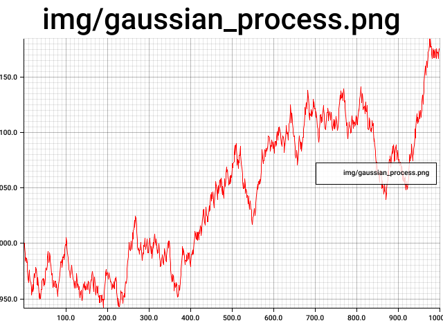

# Timeseries Generator in Rust
Generate common uniformly sampled timeseries.
Most commonly used for testing filters or technical indicators
See [MathisWellmann/go_timeseries_generator](https://github.com/MathisWellmann/go_timeseries_generator) for a Go package with the same functions.

## Features:
- Gaussian Process
- SineWave
- StepFunction

### Images:

### Tests:
To run tests create img directory first.