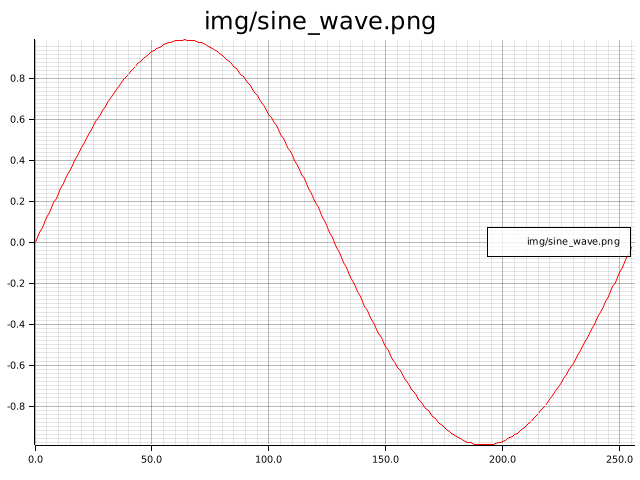

# Time Series Generator in Rust :chart_with_upwards_trend:
Generate various time series, some randomly sampled.
Most commonly used for testing filters or technical indicators
See [MathisWellmann/go_timeseries_generator](https://github.com/MathisWellmann/go_timeseries_generator)
 for a Go package with similar functionality.

## Features:
- Geometric brownian motion
- Mackey Glass
- Gaussian process (Standard Normal)
- Sine wave function
- Step function
- Triangle wave

## How to Use
To include this crate in your project, add the following to your Cargo.toml:

```toml
[dependencies]
time-series-generator = "0.3.1"
```

### Images:





### Tests
To generate the test images presented in this README, run them using:

```shell_scipt
cargo test
```

### Contributions
If you want to expand the functionality of this crate, feel free to create a Pull Request. 
Any help is appreciated.

### Donations :moneybag: :money_with_wings:
I you would like to support the development of this crate, feel free to send over a donation:

Monero (XMR) address:
```plain
47xMvxNKsCKMt2owkDuN1Bci2KMiqGrAFCQFSLijWLs49ua67222Wu3LZryyopDVPYgYmAnYkSZSz9ZW2buaDwdyKTWGwwb
```


## License
Copyright (C) 2020  <MathisWellmann wellmannmathis@gmail.com>

This program is free software: you can redistribute it and/or modify
it under the terms of the GNU Affero General Public License as published by
the Free Software Foundation, either version 3 of the License, or
(at your option) any later version.

This program is distributed in the hope that it will be useful,
but WITHOUT ANY WARRANTY; without even the implied warranty of
MERCHANTABILITY or FITNESS FOR A PARTICULAR PURPOSE.  See the
GNU Affero General Public License for more details.

You should have received a copy of the GNU Affero General Public License
along with this program.  If not, see <https://www.gnu.org/licenses/>.


